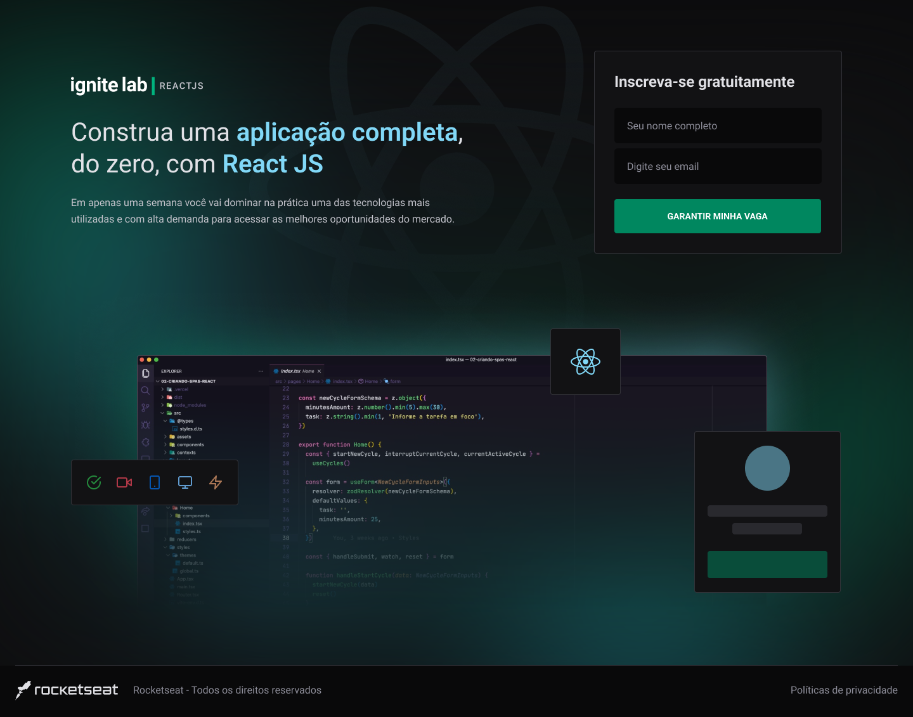
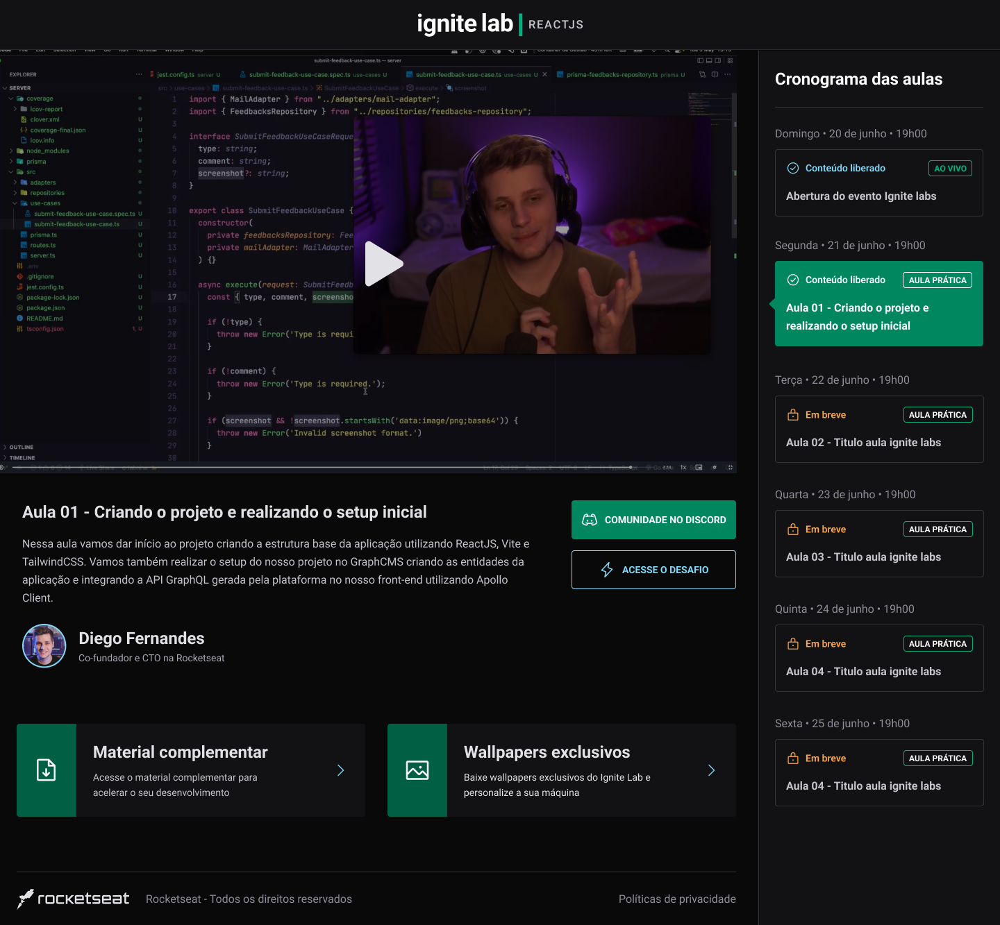
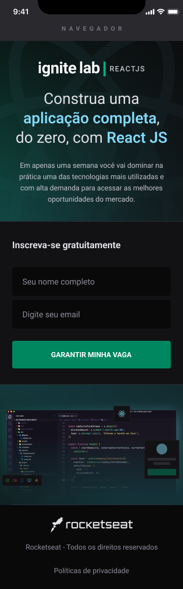
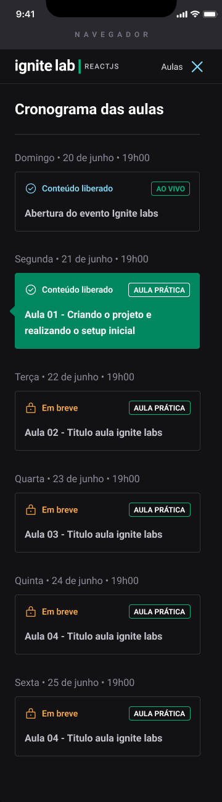

<h1 align="center">
  
<h1>

# 🌐 About

The **Ignite Lab** project is a specialization in React for developers to reach their next level.

# 🖥 Desktop

Subscriber     |  Lessons
:-------------------------:|:-------------------------:
  |  

# 📱 Mobile

Subscriber     |  Lessons
:-------------------------:|:-------------------------:
  |  

# 🤔 Technologies used

- [React.js](https://reactjs.org/)
- [Vite](https://vitejs.dev/)
- [TailwindCSS](https://tailwindcss.com/)
- [GraphQL](https://graphql.org/)
- [GraphCMS](https://graphcms.com/)

# 📁 How to download project

```bash

    # Clone repository
    $ git clone https://github.com/viniciusperrone/Ignite-Lab

    # Enter directory
    $ cd event-platform

    # Install all dependencies
    $ npm i
    
    # Start server
    $ cd frontend

```
